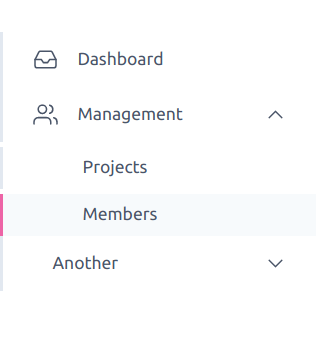

<h1 align="center">react-minimal-side-navigation</h1>
<p align="center">  </p>
<div align="center">
  <a href="https://www.npmjs.com/package/react-minimal-side-navigation">
    
  </a>
  <a href="https://travis-ci.com/abhijithvijayan/react-minimal-side-navigation">
    
  </a>
  </a>
  <a href="https://david-dm.org/abhijithvijayan/react-minimal-side-navigation">
    
  </a>
  <a href="https://github.com/abhijithvijayan/react-minimal-side-navigation/blob/main/license">
    
  </a>
  <a href="https://twitter.com/intent/tweet?text=Check%20out%20react-minimal-side-navigation%21%20by%20%40_abhijithv%0A%0AMinimal%20side%20navigation%20component%20for%20React%0Ahttps%3A%2F%2Fgithub.com%2Fabhijithvijayan%2Freact-minimal-side-navigation%0A%0A%23react%20%23sidenavigation%20%23library%20%23javascript%20%23typescript">
     
  </a>
</div>
<h3 align="center">🙋‍♂️ Made by <a href="https://twitter.com/_abhijithv">@abhijithvijayan</a></h3>
<p align="center">
  Donate:
  <a href="https://www.paypal.me/iamabhijithvijayan" target='_blank'><i><b>PayPal</b></i></a>,
  <a href="https://www.patreon.com/abhijithvijayan" target='_blank'><i><b>Patreon</b></i></a>
</p>
<p align="center">
  <a href='https://www.buymeacoffee.com/abhijithvijayan' target='_blank'>
    
  </a>
</p>
<hr />

❤️ it? ⭐️ it on [GitHub](https://github.com/abhijithvijayan/react-minimal-side-navigation/stargazers) or [Tweet](https://twitter.com/intent/tweet?text=Check%20out%20react-minimal-side-navigation%21%20by%20%40_abhijithv%0A%0AMinimal%20side%20navigation%20component%20for%20React%0Ahttps%3A%2F%2Fgithub.com%2Fabhijithvijayan%2Freact-minimal-side-navigation%0A%0A%23react%20%23sidenavigation%20%23library%20%23javascript%20%23typescript) about it.



## Table of Contents

- [Demo](#demo)
- [Installation](#installation)
- [Usage](#usage)
- [API](#api)
- [Issues](#issues)
  - [🐛 Bugs](#-bugs)
- [LICENSE](#license)

## Demo

> https://codesandbox.io/s/react-minimal-side-navigation-example-y299d

## Installation

Ensure you have [Node.js](https://nodejs.org) 10 or later installed. Then run the following:

```
# via npm
npm install react-minimal-side-navigation

# or yarn
yarn add react-minimal-side-navigation
```

## Usage

```js
import React from 'react';

import {Navigation} from 'react-minimal-side-navigation';
import 'react-minimal-side-navigation/lib/ReactMinimalSideNavigation.css';

function App() {
    return (
      <>
        <Navigation
            // you can use your own router's api to get pathname
            activeItemId="/management/members"
            onSelect={({itemId}) => {
              // maybe push to the route
            }}
            items={[
              {
                title: 'Dashboard',
                itemId: '/dashboard',
                // you can use your own custom Icon component as well
                // icon is optional
                elemBefore: () => <Icon name="inbox" />,
              },
              {
                title: 'Management',
                itemId: '/management',
                elemBefore: () => <Icon name="users" />,
                subNav: [
                  {
                    title: 'Projects',
                    itemId: '/management/projects',
                  },
                  {
                    title: 'Members',
                    itemId: '/management/members',
                  },
                ],
              },
              {
                title: 'Another Item',
                itemId: '/another',
                subNav: [
                  {
                    title: 'Teams',
                    itemId: '/management/teams',
                  },
                ],
              },
            ]}
          />
      </>
    );
}

```

## API

#### items

Type: `array`

Navigation items to render.

#### activeItemId

Type: `string`

Currently selected item id.

#### onSelect

Type: `function`

Called when item is clicked.

## Issues

_Looking to contribute? Look for the [Good First Issue](https://github.com/abhijithvijayan/react-minimal-side-navigation/issues?q=is%3Aissue+is%3Aopen+sort%3Aupdated-desc+label%3A%22good+first+issue%22)
label._

### 🐛 Bugs

Please file an issue [here](https://github.com/abhijithvijayan/react-minimal-side-navigation/issues/new) for bugs, missing documentation, or unexpected behavior.

[**See Bugs**](https://github.com/abhijithvijayan/react-minimal-side-navigation/issues?q=is%3Aissue+is%3Aopen+sort%3Aupdated-desc+label%3A%22type%3A+bug%22)

### Linting & TypeScript Config

- Shared Eslint & Prettier Configuration - [`@abhijithvijayan/eslint-config`](https://www.npmjs.com/package/@abhijithvijayan/eslint-config)
- Shared TypeScript Configuration - [`@abhijithvijayan/tsconfig`](https://www.npmjs.com/package/@abhijithvijayan/tsconfig)

## License

MIT © [Abhijith Vijayan](https://abhijithvijayan.in)
